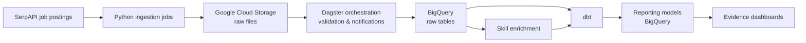

# Jobs Data Platform

An end-to-end data platform that turns job postings into practical labor-market intelligence for job seekers and recruiters.

[Live dashboard](https://jobs-data-platform.vercel.app/) · [LinkedIn / Contact](https://www.linkedin.com/in/tanner-klein-411bb31a2/)


## Why I built this

Job-market data is plentiful but fragmented. Individual postings can answer “what jobs are open today?”, but they do not easily answer broader questions:

- Which roles show the strongest current opportunity?
- Which skills appear most often for a target role?
- Is demand growing, stable, or cooling?
- What salary and location patterns are visible in the available data?

This project demonstrates how I approach those questions as a data engineer: ingest raw data, create reliable models, apply quality checks, enrich the data, and publish decision-ready reporting.

## What it does

The platform collects job-posting data and presents it through three interactive reports:

| Report | Question it answers |
| --- | --- |
| Career Opportunity Explorer | Which role should I target right now? |
| Skills Intelligence | Which skills should I prioritize? |
| Market Dynamics | How is the job market changing over time? |

Users can filter results by job title, platform, listing status, date range, location, seniority, and other job attributes.

## Architecture



## Engineering highlights

- **Cloud-based ingestion:** Python jobs collect and load job-posting data into Google Cloud Storage and BigQuery.
- **Orchestration:** Dagster manages ingestion assets, validation, retries, and operational notifications.
- **Analytics engineering:** dbt transforms raw data through staging, intermediate, mart, analysis, and reporting layers.
- **Data quality:** The project includes dbt tests, source-freshness checks, ingest-time validation, and failure notifications.
- **Skill enrichment:** Job descriptions are processed into analysis-ready skill signals.
- **Interactive delivery:** Evidence serves filterable dashboards backed by BigQuery reporting models.
- **Automated delivery:** GitHub Actions supports scheduled data-model runs and dashboard deployments.

## Data model

The dbt project follows a layered design:

```text
Raw job-posting data
        ↓
Staging models
  • standardized fields
  • source cleanup
        ↓
Intermediate / marts
  • deduplicated listings
  • dates and job-skill dimensions
  • listing lifecycle logic
        ↓
Analysis / reporting
  • opportunity scoring
  • job-flow trends
  • skill demand
  • dashboard-ready tables
```

The dashboard reads only from the reporting layer, keeping presentation logic separate from transformation logic.

## Technology stack

- Python
- Google Cloud Storage
- BigQuery
- dbt Core
- Dagster
- DuckDB
- Evidence
- Svelte components
- Docker
- GitHub Actions
- Vercel

## Repository layout

```text
.
├── dags/                       # Python ingestion, loading, and enrichment jobs
├── dbt/                        # BigQuery dbt project and data tests
├── jobs-evidence/              # Evidence dashboard application
├── orchestration/
│   └── jobs_orchestrator/      # Dagster assets, sensors, resources, and tests
├── assets/                     # Portfolio screenshots and supporting materials
├── controller.py               # Cloud Run job dispatcher
├── Dockerfile.prod             # Production container definition
└── cloudbuild.yaml             # Container build configuration
```

## Local development

This project relies on cloud credentials and environment variables that are intentionally not committed to the repository.

### Python jobs

```bash
python -m venv .venv
source .venv/bin/activate
pip install -r requirements.txt

python controller.py serpapi_get_jobs
python controller.py gcs_to_bq_load
python controller.py enrich_skills
```

### dbt

```bash
dbt deps --project-dir dbt --profiles-dir dbt
dbt seed --project-dir dbt --profiles-dir dbt
dbt run --select +tag:daily --project-dir dbt --profiles-dir dbt
dbt test --project-dir dbt --profiles-dir dbt
```

### Dashboard

```bash
cd jobs-evidence
npm install
npm run dev
```

## Current scope and limitations

This is a proof of concept intentionally scoped to a curated set of job titles and locations. The goal is to demonstrate a complete, maintainable data-product pattern rather than to index every job posting on the internet.

Job-market data is time-sensitive and source-dependent. Metrics should be interpreted as signals within the platform’s available coverage—not as a complete representation of the full labor market.

## What I would build next

- Broaden title, location, and source coverage
- Add a visible data-freshness indicator to each report
- Make the opportunity-score methodology explorable in the application
- Add monitoring dashboards for pipeline health and data-quality trends
- Introduce historical snapshots for stronger trend analysis
- Add a reproducible, anonymized sample dataset for easier local evaluation

## Author

Built by Tanner Klein, an Analytics Engineer focused on building reliable, decision-ready data products.
